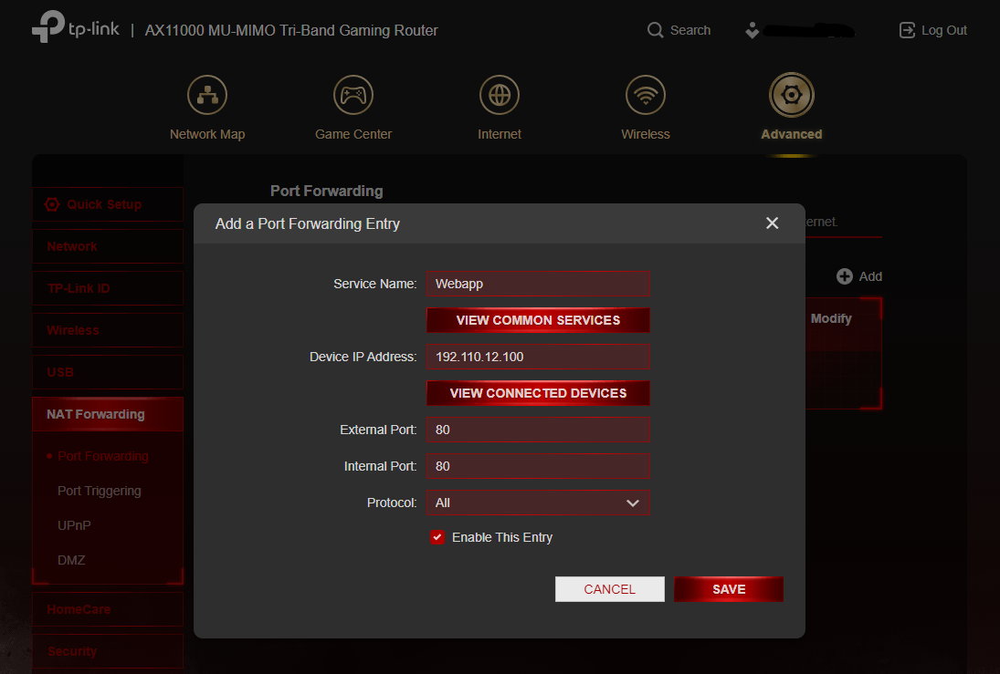
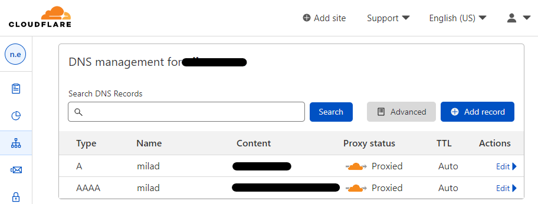

To run CyberLab pentest Academy, the following steps need to be taken:
1. Prepare a server
2. Install needed packages
3. Configure the server (network / firewall)
4. Set up DNS
5. Configure the webserver
6. Set up an SSL certificate
7. Run the webapp

# 1. Prepare Sever
The first thing is to have a server. You can have a virtualized server on your home lab or a VPS. CyberLab is tested on Debian 10, but should perfectly work on other operating systems too.
## VPS Server
In this case, the service provider will provide you with a number of OS options, usually Debian is included. Just select it and go further with installation of the OS.
## Home Lab
You can have different virtualization setups: VMware, VirtualBox, Proxmox, etc. Just set up your virtualization and install Debian. If you do not know how to install Debian, here is a [video instruction](https://youtu.be/bB-gmnvYDao).

# 2. Install Packages
When the server is up and ready, just login through SSH (or VNC) and install needed packages and tools.
## 2.1. Update and Upgrade
First thing first is to update and upgrade existing packages, that can be done by running commands as follows.
```bash
sudo apt update && sudo apt upgrade
```
## 2.2. Python and PIP
Python should be installed by default but in case, it could be installed by the following code
```bash
sudo apt install python3-pip
```
## 2.3. Flask, Gunicorn, and Flask-Session
Flask is a web-framework for Python that let us develop webapps with Python. Flask-Session is a Flask extension that enables the server side sessions. Gunicorn is a WSGI HTTP Server for UNIX that help us run our developed webapp on a Linux server.

To install these packages, we need to use `pip`. We need to use in with `sudo` which is not a good option but as we need to run our webapp with some `sudo` privilleges, we need to install these Python packages with `sudo`.
```bash
sudo pip install flask gunicorn Flask-Session
```
Alternatively, you can simply run `sudo pip install requirements.txt` to install all needed packages.

## 2.4. Pentest Tools
CyberLab includes three pentest tools that are needed to be installed on the server. Here is the commands to install them.
```bash
sudo apt install nmap
sudo apt install wapiti
sudo pip install sslyze
```

## 2.5. Webserver and Firewall
First let's install a firewall package. I prefer UFW as it is simple and effective.
```bash
sudo apt install ufw
```
As we need a web-server, I prefer to use Nginx which work better with Flask.
```bash
sudo apt install nginx
```

## 2.6. SSL Certificate
To install the SSL certificate on my web app, I preferred to use Let's Encrypt as it is a free and secure service. To install it on the server, use the following commands. Just remember to install it after the web server, Nginx.
```bash
# first install snapd
sudo apt install snapd -y

# and this snapd, install letsencrypt
sudo snap install --classic certbot
```

## 2.7 GIT
To be able to clone CyberLab from its Github repository, we need to install `git` by running the following command.
```bash
sudo apt install git
```

# 3. Sever Configuration
In order to be able to access the webapp from the Internet, we need to set up the firewall and make sure the networking is set up correctly. By finishing this step, you should be able to access your server by visiting `http://your_public_ip` on your browser or via terminal by `curl http://your_public_ip`.

## 3.1. Firewall
We need to have access to some ports including `80`, `443`, `5000`, and `22`. These port are blocked by default and need to be opened by setting up some firewall rules. UFW has app bundles that can be seen by running `sudo ufw app list`; for this purpose we are more interested in `Nginx Full` as well as two other ports (`22` for SSH and `5000` as our webapp can properly work on the ports `80` or `443`).

To set up firewall rules, run the following command.
```bash
sudo ufw allow 'Nginx HTTP',22,5000
```

We can see the result by running the following command.
```bash
sudo ufw status
```

## 3.2. Network Setup
If you run the webapp on a VPS, you can ignore this section. If you have a home lab, you need to allow ports on your firewall (modem) too. The instruction differs based on the brand of the modem and/or firewall. Just google how you can `open ports on [brand_of_your_modem]` or login to the modem management and look for port forwarding. Here, you need to tell what port on which device should be opened.

In the screenshot below, I set up the port `80` on my router to be open for the device `192.110.12.100`. You need to do the same for ports `443`, `5000`, and `22`.



The device is usually is defined by its IP address. If you do not know how to get your server's IP, just run `ip addr` on Linux or `ipconfig` on Windows.


# 4. DNS and DDNS
As we probably need to have basic DNS setup for a domain we would like to show our webapp, I use Cloudflare. You can set up a [Dynamic DNS](https://github.com/namnamir/configurations-and-security-hardening/blob/main/DDNS.md) if you are on your home lab.

As I would like to have the stup onThe setup is like this:
```
sub.domain.ltd -> public_ip_v4
sub.domain.ltd -> public_ip_v6
```
To do so, we need to set up `A` and `AAAA` DNS records for the desired subdomain. Here you can see my setup. Bere in mind that if you use home lab, you need to turn off the proxy (the orange sign beside `Proxied`).


# 5. Webserver Configuration
Now, we have pointed our domain to our IP. It is the time to set up our webserver to understand the domain we have. By finishing this step, you should be able to access your server by visiting `http://domain.tld` on your browser or via terminal by `curl http://domain.tld`.

First you need to create a config file for your domain in `/etc/ngnix/sites-available` by `sudo nano /etc/nginx/sites-available/domain.tld` and add the following lines.
```nginx
server {
    listen 80;
    listen [::]:80;
    server_name  domain.ltd www.domain.ltd;
    root /path/to/webapp;
}
```
After saving changes, we can check the configuration by `sudo nginx -t`. If everything is `ok`, we can restart the Nginx service by `sudo service nginx restart` or `sudo systemctl reload nginx` to apply our changes.

Uptill now

# 6. Setup Certificate
By having LetsEncrypt on the server, we can install the certificate for our webapp. To do so, run the following command.  By finishing this step, you should be able to access your server on SSL by visiting `https://domain.tld` on your browser or via terminal by `curl https://domain.tld`.
```bash
sudo certbot --nginx -d domain.tld -d www.domain.tld -d milad.domain.tld
```

## Reconfigure Ngnix Config File
As I use a subdomain, and as I like to redirect ports `443` and `80` to `5000`, I need to do some changes to the config file. So, I open `/etc/nginx/sites-enabled/domain.ltd` and edit it as follows.
```bash
erver {
    listen 443 ssl http2;
    listen [::]:443 ssl http2;

    server_name domain.ltd www.domain.ltd www.domain.tld;
    root /path/to/webapp;

    ssl_certificate /etc/letsencrypt/live/domain.ltd/fullchain.pem; # managed by Certbot
    ssl_certificate_key /etc/letsencrypt/live/domain.ltd/privkey.pem; # managed by Certbot

    # redirect https to port 5000
    return 301 https://www.domain.ltd:5000$request_uri;
    client_max_body_size 100M;

    autoindex off;
}

server {
    listen 80;
    listen [::]:80;

    server_name  domain.ltd www.domain.ltd www.domain.tld;
    
    # redirect http to https port 5000
    return 301 https://www.domain.ltd:5000$request_uri;
}
```
And again, check if Nginx is formatted correctly by 'sudo nginx -t' and restart it by `sudo service nginx restart` or `sudo systemctl reload nginx`.

# 7. Lunching WebApp
Everything seems fine. We just need to clone the webapp on our server and run it.

## Clone the WebApp
To clone the webapp, go the path you like to clone the webapp and run the following command.
```bash
git clone https://github.com/jeljelir/CyberLab.git
```

## Run it
And the very last step is to go to the `CyberLab` folder and run the app by this command.
```bash
sudo gunicorn --certfile /etc/letsencrypt/live/domain.tld/fullchain.pem --keyfile /etc/letsencrypt/live/domain.tld/privkey.pem --bind 0.0.0.0:5000 app:app
```
